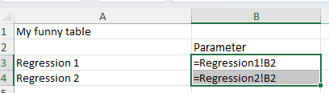

This document describes a relatively straightforward way to create complex tables from standard regression output. While the example here could presumably be consructed using standard R tools, it simply serves to illustrate the principle. 

The included file [`regression_results.xlsx`](regression_results.xlsx) has a tab called "My funny table", which references the content of the two other tabs:



The content of the two tabs `Regression1` and `Regression2` will be filled with the output from the two regressions run in this document. I have explicitly not set a seed, so that the values change very time you run the file. You can verify that the "funny table" is automatically updated with the latest results.

> You can find the full code as a Quarto (R) file at <https://github.com/larsvilhuber/writing-r-to-excel>.


## Setup

Load required packages and set up environment. The package [openxlsx](https://cran.r-project.org/web/packages/openxlsx/index.html) is used in preference to `writexl` because we explicitly want to preserve the contens of any existing (formatted!) Excel file.


::: {.cell}

```{.r .cell-code}
library(tidyverse)
```

::: {.cell-output .cell-output-stderr}

```
── Attaching core tidyverse packages ──────────────────────── tidyverse 2.0.0 ──
✔ dplyr     1.1.4     ✔ readr     2.1.5
✔ forcats   1.0.0     ✔ stringr   1.5.1
✔ ggplot2   3.5.1     ✔ tibble    3.2.1
✔ lubridate 1.9.4     ✔ tidyr     1.3.1
✔ purrr     1.0.2     
── Conflicts ────────────────────────────────────────── tidyverse_conflicts() ──
✖ dplyr::filter() masks stats::filter()
✖ dplyr::lag()    masks stats::lag()
ℹ Use the conflicted package (<http://conflicted.r-lib.org/>) to force all conflicts to become errors
```


:::

```{.r .cell-code}
library(openxlsx)
library(broom)
```
:::


## Data Generation

Create sample datasets for the regression analyses.


::: {.cell}

```{.r .cell-code}
# Create sample data for first regression
set.seed(123)
data1 <- tibble(
  x1 = rnorm(100),
  x2 = rnorm(100),
  y1 = 2*x1 + 0.5*x2 + rnorm(100)
)

# Create sample data for second regression
data2 <- tibble(
  z1 = rnorm(100),
  z2 = rnorm(100),
  z3 = rnorm(100),
  y2 = 1.5*z1 - 0.8*z2 + 0.3*z3 + rnorm(100)
)
```
:::


## Analysis

Perform regression analyses on both datasets.


::: {.cell}

```{.r .cell-code}
# Run regressions
reg1 <- lm(y1 ~ x1 + x2, data = data1)
reg2 <- lm(y2 ~ z1 + z2 + z3, data = data2)

# Convert regression results to tidy format
reg1_results <- tidy(reg1)
reg2_results <- tidy(reg2)
```
:::


### Save Results

Depending on what you want to do, you could simply post-process the existing tables, creating a simple dataset that is printed. Here, we save the individual results as datasets.
If you were to split this document into three parts -- `Data generation`, `Analysis`, and `Tables` -- then this would be the last part of your analysis part.


::: {.cell}

```{.r .cell-code}
# Save regression results as RDS files
saveRDS(reg1_results, "regression1_results.rds")
saveRDS(reg2_results, "regression2_results.rds")
```
:::


## Tables

### Formatting Results via Excel

Here, however, we want to simulate what might be a far more complex table.


::: {.cell}

```{.r .cell-code}
# Read data back in, as if we were a separate program

reg1_results <- readRDS("regression1_results.rds")
reg2_results <- readRDS("regression2_results.rds")
```
:::


I use a function here, in order to handle the case when a file exists, and when one doesn't. The very first time you would use this, no Excel file exists, but subsequent runs would overwrite the tabs within the existing file.


::: {.cell}

```{.r .cell-code}
# Function to write to Excel, creating file if it doesn't exist
write_to_excel <- function(results_list, filename) {
  # Check if file exists
  if (!file.exists(filename)) {
    # Create new workbook if file doesn't exist
    message("Creating new file")
    wb <- createWorkbook()
  } else {
    # Load existing workbook if file exists
    message("Re-using existing file")
    wb <- loadWorkbook(filename)
  }
  
  # Loop through the results list and write/overwrite sheets
  for (sheet_name in names(results_list)) {
    # Remove sheet if it already exists
    if (sheet_name %in% names(wb)) {
      removeWorksheet(wb, sheet_name)
    }
    # Add new worksheet
    addWorksheet(wb, sheet_name)
    # Write data to worksheet
    writeData(wb, sheet_name, results_list[[sheet_name]])
  }
  
  # Save workbook
  saveWorkbook(wb, filename, overwrite = TRUE)
}

# Create list of results
regression_results <- list(
  "Regression1" = reg1_results,
  "Regression2" = reg2_results
)

# Write to Excel file
write_to_excel(regression_results, "regression_results.xlsx")
```

::: {.cell-output .cell-output-stderr}

```
Re-using existing file
```


:::
:::


### Display Results Here

Show the regression results in the document.


::: {.cell}

```{.r .cell-code}
# Display results from first regression
cat("Results from Regression 1:\n")
```

::: {.cell-output .cell-output-stdout}

```
Results from Regression 1:
```


:::

```{.r .cell-code}
knitr::kable(reg1_results)
```

::: {.cell-output-display}


|term        |  estimate| std.error| statistic|   p.value|
|:-----------|---------:|---------:|---------:|---------:|
|(Intercept) | 0.1350654| 0.0961401|  1.404882| 0.1632508|
|x1          | 1.8668285| 0.1048695| 17.801445| 0.0000000|
|x2          | 0.5238113| 0.0989947|  5.291307| 0.0000008|


:::

```{.r .cell-code}
cat("\nResults from Regression 2:\n")
```

::: {.cell-output .cell-output-stdout}

```

Results from Regression 2:
```


:::

```{.r .cell-code}
knitr::kable(reg2_results)
```

::: {.cell-output-display}


|term        |   estimate| std.error| statistic|   p.value|
|:-----------|----------:|---------:|---------:|---------:|
|(Intercept) | -0.1563012| 0.1048648| -1.490501| 0.1393709|
|z1          |  1.4305458| 0.1009734| 14.167548| 0.0000000|
|z2          | -0.7925999| 0.1079181| -7.344456| 0.0000000|
|z3          |  0.2206171| 0.1141786|  1.932210| 0.0562816|


:::
:::


### Directory Contents

Show files created in the working directory.


::: {.cell}

```{.r .cell-code}
# List all files in current working directory
list.files(pattern = "(xlsx|rds)$")
```

::: {.cell-output .cell-output-stdout}

```
[1] "regression_results.xlsx"          "regression_results_template.xlsx"
[3] "regression1_results.rds"          "regression2_results.rds"         
```


:::
:::


## Housekeeping


::: {.cell}

```{.r .cell-code}
sessionInfo()
```

::: {.cell-output .cell-output-stdout}

```
R version 4.4.2 (2024-10-31 ucrt)
Platform: x86_64-w64-mingw32/x64
Running under: Windows 11 x64 (build 26100)

Matrix products: default


locale:
[1] LC_COLLATE=English_United States.utf8 
[2] LC_CTYPE=English_United States.utf8   
[3] LC_MONETARY=English_United States.utf8
[4] LC_NUMERIC=C                          
[5] LC_TIME=English_United States.utf8    

time zone: America/Toronto
tzcode source: internal

attached base packages:
[1] stats     graphics  grDevices datasets  utils     methods   base     

other attached packages:
 [1] broom_1.0.7      openxlsx_4.2.7.1 lubridate_1.9.4  forcats_1.0.0   
 [5] stringr_1.5.1    dplyr_1.1.4      purrr_1.0.2      readr_2.1.5     
 [9] tidyr_1.3.1      tibble_3.2.1     ggplot2_3.5.1    tidyverse_2.0.0 

loaded via a namespace (and not attached):
 [1] gtable_0.3.6      jsonlite_1.8.9    compiler_4.4.2    renv_1.0.11      
 [5] zip_2.3.1         Rcpp_1.0.13-1     tidyselect_1.2.1  scales_1.3.0     
 [9] yaml_2.3.10       fastmap_1.2.0     R6_2.5.1          generics_0.1.3   
[13] knitr_1.49        backports_1.5.0   munsell_0.5.1     pillar_1.9.0     
[17] tzdb_0.4.0        rlang_1.1.4       utf8_1.2.4        stringi_1.8.4    
[21] xfun_0.49         timechange_0.3.0  cli_3.6.3         withr_3.0.2      
[25] magrittr_2.0.3    digest_0.6.37     grid_4.4.2        rstudioapi_0.17.1
[29] hms_1.1.3         lifecycle_1.0.4   vctrs_0.6.5       evaluate_1.0.1   
[33] glue_1.8.0        fansi_1.0.6       colorspace_2.1-1  rmarkdown_2.29   
[37] tools_4.4.2       pkgconfig_2.0.3   htmltools_0.5.8.1
```


:::
:::
